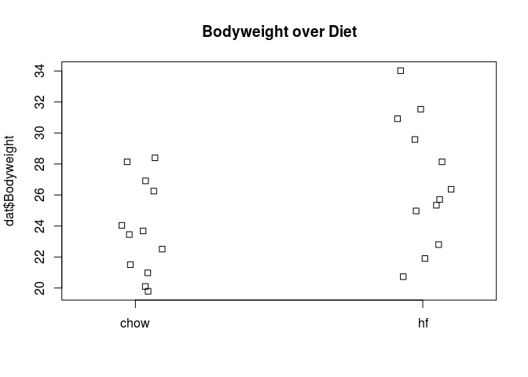
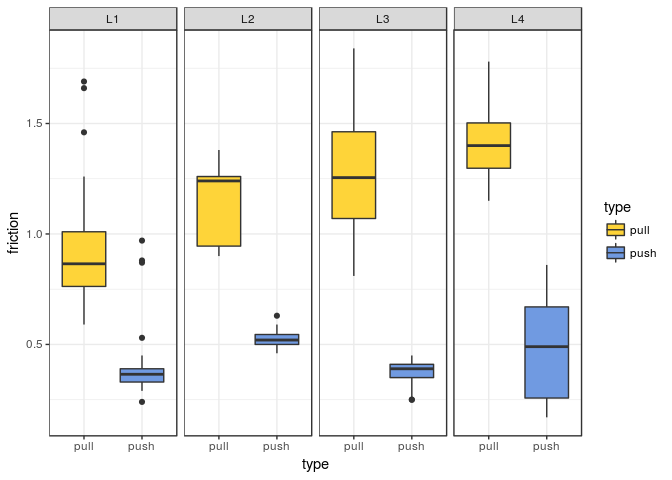
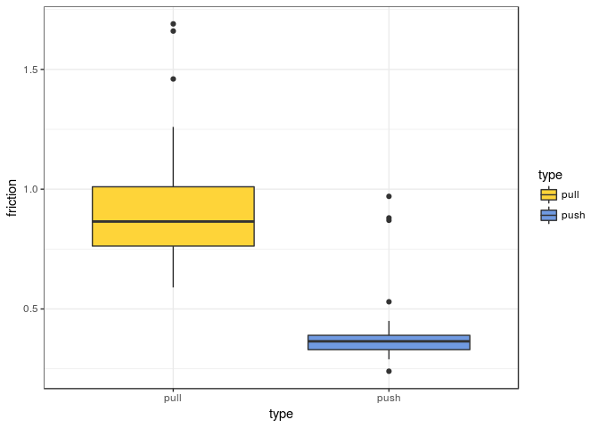
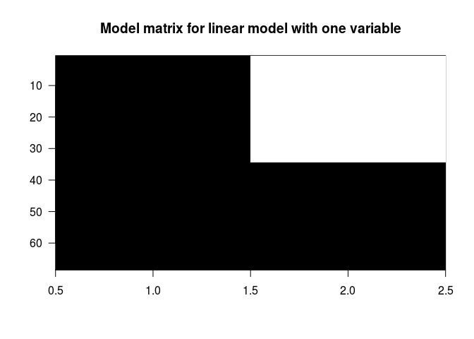
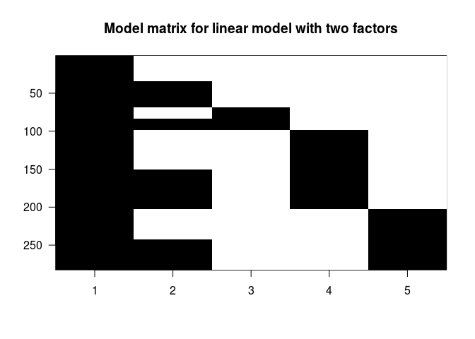
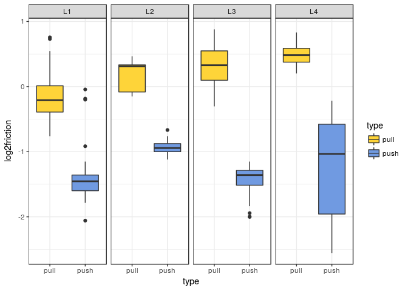

# Meeting April
Redgar  
April 3, 2017  


```r
setwd("~/Documents/Side/DAWG/")
library(rafalib)
library(UsingR)
library(contrast)
```
# Excercise 1

```r
g = 9.8
h0 = 56.67
v0 = 0
n = 25
tt = seq(0,3.4,len=n)
y = h0 + v0 *tt - 0.5* g*tt^2 + rnorm(n,sd=1)

X = cbind(1,tt,tt^2)
A = solve(crossprod(X))%*%t(X)

# 1 C
-2 * (A %*% y) [3]
```

```
## [1] 8.878404
```

```r
# 2  issue:got same as sam not as alex
se<-function(x) sd(x)/sqrt(length(x))

est_g<-function(x) {
  y = h0 + v0 *tt - 0.5* g*tt^2 + rnorm(n,sd=1)
  X = cbind(1,tt,tt^2)
  A = solve(crossprod(X))%*%t(X)
  -2 * (A %*% y) [3]
}

g_estimates<-replicate(100000,est_g(1), simplify = "array")
se(g_estimates)
```

```
## [1] 0.001363764
```

```r
# 3

x = father.son$fheight
y = father.son$sheight
n = length(y)

N = 50
index = sample(n,N)
sampledat = father.son[index,]
x = sampledat$fheight
y = sampledat$sheight
betahat = lm(y~x)$coef
slope = lm(y~x)$coef[2]
slope
```

```
##         x 
## 0.8470997
```

```r
slope_height<-function(x){
  N = 50
  index = sample(n,N)
  sampledat = father.son[index,]
  x = sampledat$fheight
  y = sampledat$sheight
  betahat = lm(y~x)$coef
  slope = lm(y~x)$coef[2]
  slope
}


slope_estimates<-replicate(10000,slope_height(1), simplify = "array")
se(slope_estimates)
```

```
## [1] 0.001225954
```

```r
# 4 C

x = father.son$fheight
y = father.son$sheight

mean((y - mean(y))*(x-mean(x)))
```

```
## [1] 3.869739
```

#### The design matrix

```r
group <- factor( c(1,1,2,2) )
model.matrix(~ group)
```

```
##   (Intercept) group2
## 1           1      0
## 2           1      0
## 3           1      1
## 4           1      1
## attr(,"assign")
## [1] 0 1
## attr(,"contrasts")
## attr(,"contrasts")$group
## [1] "contr.treatment"
```

```r
diet <- factor(c(1,1,1,1,2,2,2,2))
sex <- factor(c("f","f","m","m","f","f","m","m"))
model.matrix(~ diet + sex)
```

```
##   (Intercept) diet2 sexm
## 1           1     0    0
## 2           1     0    0
## 3           1     0    1
## 4           1     0    1
## 5           1     1    0
## 6           1     1    0
## 7           1     1    1
## 8           1     1    1
## attr(,"assign")
## [1] 0 1 2
## attr(,"contrasts")
## attr(,"contrasts")$diet
## [1] "contr.treatment"
## 
## attr(,"contrasts")$sex
## [1] "contr.treatment"
```


#### High fat vs low fat design matrix

```r
dat <- read.csv("femaleMiceWeights.csv") ##previously downloaded
stripchart(dat$Bodyweight ~ dat$Diet, vertical=TRUE, method="jitter",main="Bodyweight over Diet")
```

<!-- -->

```r
levels(dat$Diet)
```

```
## [1] "chow" "hf"
```

```r
X <- model.matrix(~ Diet, data=dat)
head(X)
```

```
##   (Intercept) Diethf
## 1           1      0
## 2           1      0
## 3           1      0
## 4           1      0
## 5           1      0
## 6           1      0
```

```r
Y <- dat$Bodyweight
X <- model.matrix(~ Diet, data=dat)
solve(t(X) %*% X) %*% t(X) %*% Y
```

```
##                  [,1]
## (Intercept) 23.813333
## Diethf       3.020833
```

```r
#These coefficients are the average of the control group and the difference of the averages:
    ## see manually 
    s <- split(dat$Bodyweight, dat$Diet)
    mean(s[["chow"]])
```

```
## [1] 23.81333
```

```r
    mean(s[["hf"]]) - mean(s[["chow"]])
```

```
## [1] 3.020833
```

```r
# now with lm (but this lm is simply and just a fancy t-test)
fit <- lm(Bodyweight ~ Diet, data=dat)
summary(fit)
```

```
## 
## Call:
## lm(formula = Bodyweight ~ Diet, data = dat)
## 
## Residuals:
##     Min      1Q  Median      3Q     Max 
## -6.1042 -2.4358 -0.4138  2.8335  7.1858 
## 
## Coefficients:
##             Estimate Std. Error t value Pr(>|t|)    
## (Intercept)   23.813      1.039  22.912   <2e-16 ***
## Diethf         3.021      1.470   2.055   0.0519 .  
## ---
## Signif. codes:  0 '***' 0.001 '**' 0.01 '*' 0.05 '.' 0.1 ' ' 1
## 
## Residual standard error: 3.6 on 22 degrees of freedom
## Multiple R-squared:  0.1611,	Adjusted R-squared:  0.1229 
## F-statistic: 4.224 on 1 and 22 DF,  p-value: 0.05192
```

```r
(coefs <- coef(fit))
```

```
## (Intercept)      Diethf 
##   23.813333    3.020833
```

```r
summary(fit)$coefficients
```

```
##              Estimate Std. Error   t value     Pr(>|t|)
## (Intercept) 23.813333   1.039353 22.911684 7.642256e-17
## Diethf       3.020833   1.469867  2.055174 5.192480e-02
```

```r
# now as t test (you get the same t statistic either way)
ttest <- t.test(s[["hf"]], s[["chow"]], var.equal=TRUE)
summary(fit)$coefficients[2,3]
```

```
## [1] 2.055174
```

```r
ttest$statistic
```

```
##        t 
## 2.055174
```

# Excercise

```r
# 1
Nx=5
Ny=7
X <- cbind(rep(1,Nx + Ny),rep(c(0,1),c(Nx, Ny)))

(t(X) %*% X)[1,1]
```

```
## [1] 12
```

```r
#2
(t(X) %*% X) #7
```

```
##      [,1] [,2]
## [1,]   12    7
## [2,]    7    7
```


####  Variance-covariance matrix

```r
x <- father.son$fheight
y <- father.son$sheight
n <- length(y)

# Manual SE
n <- nrow(father.son)
N <- 50
index <- sample(n,N)
sampledat <- father.son[index,]
x <- sampledat$fheight
y <- sampledat$sheight
X <- model.matrix(~x)
N <- nrow(X)
p <- ncol(X)
XtXinv <- solve(crossprod(X))
resid <- y - X %*% XtXinv %*% crossprod(X,y)
s <- sqrt( sum(resid^2)/(N-p))
ses <- sqrt(diag(XtXinv))*s

# lm SE
summary(lm(y~x))$coef[,2]
```

```
## (Intercept)           x 
##    9.668650    0.142659
```

# Excercises

```r
library(UsingR)
N <- 50
set.seed(1)
index <- sample(n,N)
sampledat <- father.son[index,]
x <- sampledat$fheight
y <- sampledat$sheight
betahat <- lm(y~x)$coef

#1
fit <- lm(y ~ x)
fit$fitted.values
```

```
##        1        2        3        4        5        6        7        8 
## 70.62707 70.36129 70.86093 68.73019 65.59181 70.55285 70.21256 68.62521 
##        9       10       11       12       13       14       15       16 
## 67.06729 69.64913 69.09958 71.70621 68.31598 70.57027 70.39537 70.39613 
##       17       18       19       20       21       22       23       24 
## 68.73977 68.98874 71.47021 72.03615 69.55975 68.15895 66.63557 71.53651 
##       25       26       27       28       29       30       31       32 
## 69.57083 69.71050 67.14263 70.99719 67.11046 69.04901 66.65243 67.82895 
##       33       34       35       36       37       38       39       40 
## 68.24209 70.70156 65.50431 67.36000 69.30065 67.94424 66.35150 71.40489 
##       41       42       43       44       45       46       47       48 
## 71.64301 66.81654 69.22900 69.11769 69.21793 69.69519 67.00674 68.67869 
##       49       50 
## 67.40752 69.28800
```

```r
# manual
X <- model.matrix(~x)
XtXinv <- solve(crossprod(X))
resid <- y - X %*% XtXinv %*% crossprod(X,y)
sum(resid^2)
```

```
## [1] 256.2152
```

```r
# using lm
sum(fit$residuals^2)
```

```
## [1] 256.2152
```

```r
#2
sum(resid^2)/48
```

```
## [1] 5.337816
```

```r
#3
N <- 50
X <- cbind(rep(1,N), x)

# or
X <- model.matrix(~x)
solve(t(X) %*% X)[1,1]
```

```
## [1] 11.30275
```

```r
#4
sqrt(diag(solve(t(X) %*% X)) * (sum(resid^2)/48))
```

```
## (Intercept)           x 
##   7.7673671   0.1141966
```

```r
#standard are slope
sqrt(diag(solve(t(X) %*% X)) * (sum(resid^2)/48))[2]
```

```
##         x 
## 0.1141966
```

```r
## also present in lm
summary(fit)
```

```
## 
## Call:
## lm(formula = y ~ x)
## 
## Residuals:
##     Min      1Q  Median      3Q     Max 
## -6.2030 -1.8027  0.2918  1.4226  6.8493 
## 
## Coefficients:
##             Estimate Std. Error t value Pr(>|t|)    
## (Intercept)  29.2542     7.7674   3.766 0.000453 ***
## x             0.5857     0.1142   5.129 5.19e-06 ***
## ---
## Signif. codes:  0 '***' 0.001 '**' 0.01 '*' 0.05 '.' 0.1 ' ' 1
## 
## Residual standard error: 2.31 on 48 degrees of freedom
## Multiple R-squared:  0.354,	Adjusted R-squared:  0.3406 
## F-statistic: 26.31 on 1 and 48 DF,  p-value: 5.189e-06
```


#### Interactions and contrasts spider legs!!! 
###### pg 196

```r
url <- "https://raw.githubusercontent.com/genomicsclass/dagdata/master/inst/extdata/spider_wolff_gorb_2013.csv"
filename <- "spider_wolff_gorb_2013.csv"
library(downloader)
if (!file.exists(filename)) download(url, filename)
spider <- read.csv(filename, skip=1)

table(spider$leg,spider$type)
```

```
##     
##      pull push
##   L1   34   34
##   L2   15   15
##   L3   52   52
##   L4   40   40
```

```r
# extra fun colors
library("ggsci")

ggplot(spider, aes(type, friction, fill=type))+geom_boxplot()+theme_bw()+facet_wrap(~leg, nrow=1)+scale_fill_simpsons()
```

<!-- -->

#### Linear model with one variable

```r
spider.sub <- spider[spider$leg == "L1",]
fit <- lm(friction ~ type, data=spider.sub)
summary(fit)
```

```
## 
## Call:
## lm(formula = friction ~ type, data = spider.sub)
## 
## Residuals:
##      Min       1Q   Median       3Q      Max 
## -0.33147 -0.10735 -0.04941 -0.00147  0.76853 
## 
## Coefficients:
##             Estimate Std. Error t value Pr(>|t|)    
## (Intercept)  0.92147    0.03827  24.078  < 2e-16 ***
## typepush    -0.51412    0.05412  -9.499  5.7e-14 ***
## ---
## Signif. codes:  0 '***' 0.001 '**' 0.01 '*' 0.05 '.' 0.1 ' ' 1
## 
## Residual standard error: 0.2232 on 66 degrees of freedom
## Multiple R-squared:  0.5776,	Adjusted R-squared:  0.5711 
## F-statistic: 90.23 on 1 and 66 DF,  p-value: 5.698e-14
```

```r
## Coefficients are just the means of each group
(coefs <- coef(fit))
```

```
## (Intercept)    typepush 
##   0.9214706  -0.5141176
```

```r
means<-tapply(spider.sub$friction, spider.sub$type, mean)
means
```

```
##      pull      push 
## 0.9214706 0.4073529
```

```r
means[2]-means[1]
```

```
##       push 
## -0.5141176
```

```r
##  make the model matrix that is inside the lm
X <- model.matrix(~ type, data=spider.sub)
colnames(X)
```

```
## [1] "(Intercept)" "typepush"
```

```r
ggplot(spider.sub, aes(type, friction, fill=type))+geom_boxplot()+theme_bw()+scale_fill_simpsons()
```

<!-- -->

Make a plot of a design matrix....

```r
imagemat(X, main="Model matrix for linear model with one variable")
```

<!-- -->

#### Linear model with two variables

```r
X <- model.matrix(~ type + leg, data=spider)
colnames(X)
```

```
## [1] "(Intercept)" "typepush"    "legL2"       "legL3"       "legL4"
```

```r
## THIS IS NOT HELPFUL TO ME
imagemat(X, main="Model matrix for linear model with two factors")
```

<!-- -->

```r
fitTL <- lm(friction ~ type + leg, data=spider)
summary(fitTL)
```

```
## 
## Call:
## lm(formula = friction ~ type + leg, data = spider)
## 
## Residuals:
##      Min       1Q   Median       3Q      Max 
## -0.46392 -0.13441 -0.00525  0.10547  0.69509 
## 
## Coefficients:
##             Estimate Std. Error t value Pr(>|t|)    
## (Intercept)  1.05392    0.02816  37.426  < 2e-16 ***
## typepush    -0.77901    0.02482 -31.380  < 2e-16 ***
## legL2        0.17192    0.04569   3.763 0.000205 ***
## legL3        0.16049    0.03251   4.937 1.37e-06 ***
## legL4        0.28134    0.03438   8.183 1.01e-14 ***
## ---
## Signif. codes:  0 '***' 0.001 '**' 0.01 '*' 0.05 '.' 0.1 ' ' 1
## 
## Residual standard error: 0.2084 on 277 degrees of freedom
## Multiple R-squared:  0.7916,	Adjusted R-squared:  0.7886 
## F-statistic:   263 on 4 and 277 DF,  p-value: < 2.2e-16
```

```r
(coefs <- coef(fitTL))
```

```
## (Intercept)    typepush       legL2       legL3       legL4 
##   1.0539153  -0.7790071   0.1719216   0.1604921   0.2813382
```

```r
## least squares estimate of model
Y <- spider$friction
X <- model.matrix(~ type + leg, data=spider)
beta.hat <- solve(t(X) %*% X) %*% t(X) %*% Y
t(beta.hat)
```

```
##      (Intercept)   typepush     legL2     legL3     legL4
## [1,]    1.053915 -0.7790071 0.1719216 0.1604921 0.2813382
```

```r
## then from lm it is identical
coefs
```

```
## (Intercept)    typepush       legL2       legL3       legL4 
##   1.0539153  -0.7790071   0.1719216   0.1604921   0.2813382
```

```r
## however since the model assumes the effects are additive the L2-3 coefficients are not the same as the difference from the intercept
# the type coefficient is a weighted average of the group mean differences (weighted by the sample size of each group)
spider$group<-paste(spider$leg,spider$type, sep="")
s <- split(spider$friction, spider$group)
means<- sapply(s, mean)
ns <-sapply(s, length)[c(1,3,5,7)]
(w <- ns/sum(ns))#weights
```

```
##    L1pull    L2pull    L3pull    L4pull 
## 0.2411348 0.1063830 0.3687943 0.2836879
```

```r
sum(w * (means[c(2,4,6,8)] - means[c(1,3,5,7)]))
```

```
## [1] -0.7790071
```

#### Contrasting coefficients (that were not the intecept, L1 here) contrasts!

```r
# can be done using the contrasts package
L3vsL2 <- contrast(fitTL,list(leg="L3",type="pull"),list(leg="L2",type="pull"))
L3vsL2
```

```
## lm model parameter contrast
## 
##     Contrast       S.E.      Lower      Upper     t  df Pr(>|t|)
##  -0.01142949 0.04319685 -0.0964653 0.07360632 -0.26 277   0.7915
```

```r
# contrast matrix to pull out the L2 L3 comparison 
L3vsL2$X
```

```
##   (Intercept) typepush legL2 legL3 legL4
## 1           0        0    -1     1     0
## attr(,"assign")
## [1] 0 1 2 2 2
## attr(,"contrasts")
## attr(,"contrasts")$type
## [1] "contr.treatment"
## 
## attr(,"contrasts")$leg
## [1] "contr.treatment"
```


#### Linear Model with Interactions

```r
X <- model.matrix(~ type + leg + type:leg, data=spider)
colnames(X)
```

```
## [1] "(Intercept)"    "typepush"       "legL2"          "legL3"         
## [5] "legL4"          "typepush:legL2" "typepush:legL3" "typepush:legL4"
```

```r
head(X)
```

```
##   (Intercept) typepush legL2 legL3 legL4 typepush:legL2 typepush:legL3
## 1           1        0     0     0     0              0              0
## 2           1        0     0     0     0              0              0
## 3           1        0     0     0     0              0              0
## 4           1        0     0     0     0              0              0
## 5           1        0     0     0     0              0              0
## 6           1        0     0     0     0              0              0
##   typepush:legL4
## 1              0
## 2              0
## 3              0
## 4              0
## 5              0
## 6              0
```

```r
## now using lm
fitX <- lm(friction ~ type + leg + type:leg, data=spider)
summary(fitX)
```

```
## 
## Call:
## lm(formula = friction ~ type + leg + type:leg, data = spider)
## 
## Residuals:
##      Min       1Q   Median       3Q      Max 
## -0.46385 -0.10735 -0.01111  0.07848  0.76853 
## 
## Coefficients:
##                Estimate Std. Error t value Pr(>|t|)    
## (Intercept)     0.92147    0.03266  28.215  < 2e-16 ***
## typepush       -0.51412    0.04619 -11.131  < 2e-16 ***
## legL2           0.22386    0.05903   3.792 0.000184 ***
## legL3           0.35238    0.04200   8.390 2.62e-15 ***
## legL4           0.47928    0.04442  10.789  < 2e-16 ***
## typepush:legL2 -0.10388    0.08348  -1.244 0.214409    
## typepush:legL3 -0.38377    0.05940  -6.461 4.73e-10 ***
## typepush:legL4 -0.39588    0.06282  -6.302 1.17e-09 ***
## ---
## Signif. codes:  0 '***' 0.001 '**' 0.01 '*' 0.05 '.' 0.1 ' ' 1
## 
## Residual standard error: 0.1904 on 274 degrees of freedom
## Multiple R-squared:  0.8279,	Adjusted R-squared:  0.8235 
## F-statistic: 188.3 on 7 and 274 DF,  p-value: < 2.2e-16
```

```r
coefs <- coef(fitX)

## contrasts from an interaction model
L2push.vs.pull <- contrast(fitX,list(leg="L2", type = "push"),list(leg="L2", type = "pull"))
L2push.vs.pull
```

```
## lm model parameter contrast
## 
##  Contrast      S.E.      Lower      Upper     t  df Pr(>|t|)
##    -0.618 0.0695372 -0.7548951 -0.4811049 -8.89 274        0
```

```r
coefs[2] + coefs[6]
```

```
## typepush 
##   -0.618
```

#### Analysis of variance (here we are taught it only as an F test)

```r
## which model is a better fit?
anova(fitX)
```

```
## Analysis of Variance Table
## 
## Response: friction
##            Df Sum Sq Mean Sq  F value    Pr(>F)    
## type        1 42.783  42.783 1179.713 < 2.2e-16 ***
## leg         3  2.921   0.974   26.847 2.972e-15 ***
## type:leg    3  2.098   0.699   19.282 2.256e-11 ***
## Residuals 274  9.937   0.036                       
## ---
## Signif. codes:  0 '***' 0.001 '**' 0.01 '*' 0.05 '.' 0.1 ' ' 1
```

```r
# The sum of squares  term can be interpreted as the value of each term to reducing the models sum of squares
# here we manually calculate the term given in the ANOVA

## sum of squares with just the intercept
mu0 <- mean(spider$friction)
(initial.ss <- sum((spider$friction - mu0)^2))
```

```
## [1] 57.73858
```

```r
## sum of square with teh type of friction term
s <- split(spider$friction, spider$type)
after.type.ss <- sum( sapply(s, function(x) {
  residual <- x - mean(x)
  sum(residual^2)
  }) )
after.type.ss
```

```
## [1] 14.95551
```

```r
(type.ss <- initial.ss - after.type.ss)
```

```
## [1] 42.78307
```

```r
## as terms are added to the sum of squares calculation sequentially the order of the terms is important
```


# Exercises pg 124
Question 1

```r
species <- factor(c("A","A","B","B"))
condition <- factor(c("control","treated","control","treated"))
model.matrix(~ species + condition)
```

```
##   (Intercept) speciesB conditiontreated
## 1           1        0                0
## 2           1        0                1
## 3           1        1                0
## 4           1        1                1
## attr(,"assign")
## [1] 0 1 2
## attr(,"contrasts")
## attr(,"contrasts")$species
## [1] "contr.treatment"
## 
## attr(,"contrasts")$condition
## [1] "contr.treatment"
```

```r
fit <- lm(sample(1:100,4) ~ species + condition)
contrast(fit,list(species="B", condition = "control"),list(species="A", condition = "treated"))$X
```

```
##   (Intercept) speciesB conditiontreated
## 1           0        1               -1
## attr(,"assign")
## [1] 0 1 2
## attr(,"contrasts")
## attr(,"contrasts")$species
## [1] "contr.treatment"
## 
## attr(,"contrasts")$condition
## [1] "contr.treatment"
```

```r
# D) 0 1 -1
```

Question 2

```r
# t-value = t-statistic = estimate_mean/std.error
fit <- lm(friction ~ type + leg, data=spider)
summary(fit)$coef[,"t value"]
```

```
## (Intercept)    typepush       legL2       legL3       legL4 
##   37.426026  -31.380437    3.763184    4.937232    8.183147
```

```r
contrast(fit,list(leg="L4", type = "pull"),list(leg="L2", type = "pull"))
```

```
## lm model parameter contrast
## 
##   Contrast       S.E.      Lower     Upper    t  df Pr(>|t|)
##  0.1094167 0.04462392 0.02157158 0.1972618 2.45 277   0.0148
```

```r
#2.45 
```

Question 3

```r
cT<-contrast(fit,list(leg="L4", type = "pull"),list(leg="L2", type = "pull"))$X
#We would have obtained the same result for a contrast of L3 and L2 had we picked type="push
X <- model.matrix(~ type + leg, data=spider)
Sigma.hat <- sum(fit$residuals^2)/(nrow(X) - ncol(X)) * solve(t(X) %*% X)
signif(Sigma.hat, 2)
```

```
##             (Intercept) typepush    legL2    legL3    legL4
## (Intercept)     0.00079 -3.1e-04 -0.00064 -0.00064 -0.00064
## typepush       -0.00031  6.2e-04  0.00000  0.00000  0.00000
## legL2          -0.00064 -6.4e-20  0.00210  0.00064  0.00064
## legL3          -0.00064 -6.4e-20  0.00064  0.00110  0.00064
## legL4          -0.00064 -1.2e-19  0.00064  0.00064  0.00120
```

```r
sqrt(cT %*% Sigma.hat %*% t(cT))
```

```
##            1
## 1 0.04462392
```

```r
## or
contrast(fit,list(leg="L4", type = "pull"),list(leg="L2", type = "pull"))$SE
```

```
## [1] 0.04462392
```

Question 4

```r
spider$log2friction <- log2(spider$friction)
ggplot(spider, aes(type, log2friction, fill=type))+geom_boxplot()+theme_bw()+facet_wrap(~leg, nrow=1)+scale_fill_simpsons()
```

<!-- -->

```r
fitX <- lm(log2friction ~ type + leg + type:leg, data=spider)
summary(fitX)
```

```
## 
## Call:
## lm(formula = log2friction ~ type + leg + type:leg, data = spider)
## 
## Residuals:
##      Min       1Q   Median       3Q      Max 
## -1.35902 -0.19193  0.00596  0.16315  1.33090 
## 
## Coefficients:
##                Estimate Std. Error t value Pr(>|t|)    
## (Intercept)    -0.16828    0.06613  -2.545 0.011487 *  
## typepush       -1.20656    0.09352 -12.901  < 2e-16 ***
## legL2           0.34681    0.11952   2.902 0.004014 ** 
## legL3           0.48999    0.08505   5.762 2.24e-08 ***
## legL4           0.64668    0.08995   7.189 6.20e-12 ***
## typepush:legL2  0.09967    0.16903   0.590 0.555906    
## typepush:legL3 -0.54075    0.12027  -4.496 1.02e-05 ***
## typepush:legL4 -0.46920    0.12721  -3.689 0.000272 ***
## ---
## Signif. codes:  0 '***' 0.001 '**' 0.01 '*' 0.05 '.' 0.1 ' ' 1
## 
## Residual standard error: 0.3856 on 274 degrees of freedom
## Multiple R-squared:  0.8125,	Adjusted R-squared:  0.8077 
## F-statistic: 169.6 on 7 and 274 DF,  p-value: < 2.2e-16
```

```r
coefs <- coef(fitX)

summary(fitX)$coef["typepush:legL4","t value"]
```

```
## [1] -3.688549
```

```r
#-3.688549
```

Question 5

```r
anova(fitX)
```

```
## Analysis of Variance Table
## 
## Response: log2friction
##            Df  Sum Sq Mean Sq  F value    Pr(>F)    
## type        1 164.709 164.709 1107.714 < 2.2e-16 ***
## leg         3   7.065   2.355   15.838 1.589e-09 ***
## type:leg    3   4.774   1.591   10.701 1.130e-06 ***
## Residuals 274  40.742   0.149                       
## ---
## Signif. codes:  0 '***' 0.001 '**' 0.01 '*' 0.05 '.' 0.1 ' ' 1
```

```r
#10.701 
```

Question 6

```r
contrast(fitX,list(leg="L1", type = "pull"),list(leg="L2", type = "pull"))
```

```
## lm model parameter contrast
## 
##    Contrast      S.E.      Lower      Upper    t  df Pr(>|t|)
##  -0.3468125 0.1195246 -0.5821157 -0.1115092 -2.9 274    0.004
```

```r
#-0.3468125
```

Question 7

```r
contrast(fitX,list(leg="L1", type = "push"),list(leg="L2", type = "push"))
```

```
## lm model parameter contrast
## 
##    Contrast      S.E.      Lower     Upper     t  df Pr(>|t|)
##  -0.4464843 0.1195246 -0.6817875 -0.211181 -3.74 274    2e-04
```

```r
#-0.4464843
```

