###Explotory data analysis

```r
library(rafalib)
data(father.son,package="UsingR") ##available from CRAN
x <- father.son$fheight

## see is heights fall along the normal distribution
ps <- ( seq(0,99) + 0.5 )/100 
qs <- quantile(x, ps)
normalqs <- qnorm(ps, mean(x), popsd(x))
plot(normalqs,qs,xlab="Normal percentiles",ylab="Height percentiles")
abline(0,1) ##identity line

library(ggplot2)
```

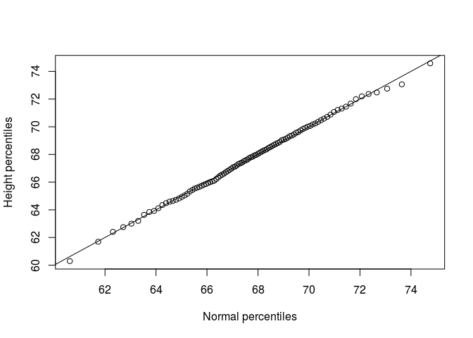<!-- -->

```r
plt<-data.frame(normalqs=normalqs,qs=qs )
ggplot(plt, aes(normalqs,qs))+geom_point(color="cornflowerblue")+
  geom_abline(intercept = 0, slope = 1, color="grey40")+theme_bw()+
  xlab("Normal percentiles")+ylab("Height percentiles")
```

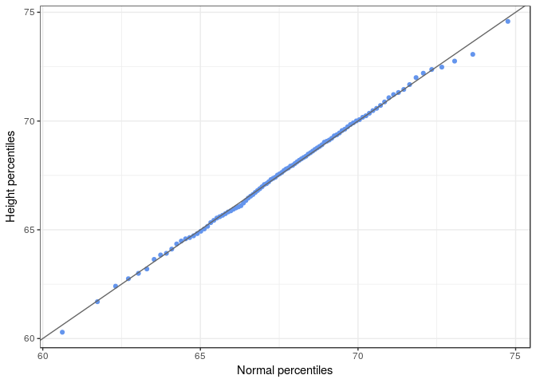<!-- -->

```r
## non-normal data qq plot
# this data pulled from a t distribution which has fatter tails

dfs <- c(3,6,12,30)
mypar(2,2)
for(df in dfs){
  x <- rt(1000,df)
  qqnorm(x,xlab="t quantiles",main=paste0("d.f=",df),ylim=c(-6,6))
  qqline(x)
}
```

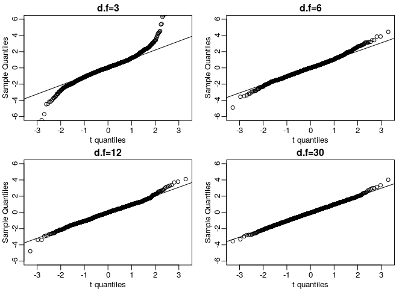<!-- -->

```r
plt2<-lapply(dfs, function(df) {x<-rt(1000, df)
data.frame(t_quantiles=quantile(x, ps), Sample_quantiles=qnorm(ps, mean(x), popsd(x)),df=df)})
plt2<-do.call(rbind, plt2)

ggplot(plt2, aes(Sample_quantiles,t_quantiles))+geom_point(color="cornflowerblue")+
  geom_abline(intercept = 0, slope = 1, color="grey40")+theme_bw()+
  xlab("t quantiles")+ylab("Sample Quantiles")+facet_wrap(~df)
```

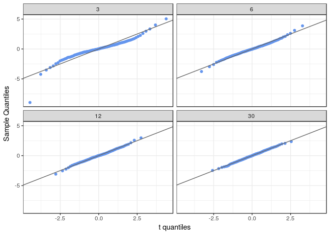<!-- -->

```r
########### 
## BOX PLOTS
###########  
library(UsingR)
```

```
## Loading required package: MASS
```

```
## Loading required package: HistData
```

```
## Loading required package: Hmisc
```

```
## Loading required package: lattice
```

```
## Loading required package: survival
```

```
## Loading required package: Formula
```

```
## 
## Attaching package: 'Hmisc'
```

```
## The following objects are masked from 'package:base':
## 
##     format.pval, round.POSIXt, trunc.POSIXt, units
```

```
## 
## Attaching package: 'UsingR'
```

```
## The following object is masked from 'package:survival':
## 
##     cancer
```

```r
mypar(1,2)
hist(exec.pay) ##in UsingR package
qqnorm(exec.pay)
qqline(exec.pay)
```

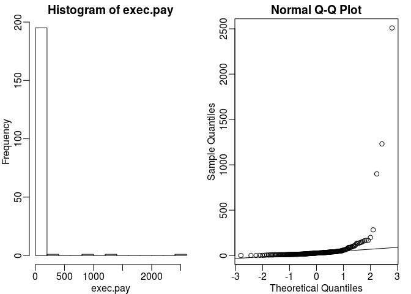<!-- -->

```r
boxplot(exec.pay, ylab="10,000s of dollars", ylim=c(0,400))

ggplot(as.data.frame(exec.pay), aes(1, exec.pay))+geom_violin(fill="grey", color="white")+geom_boxplot(width=0.2)+theme_bw()+ylim(0,400)
```

```
## Warning: Removed 3 rows containing non-finite values (stat_ydensity).
```

```
## Warning: Removed 3 rows containing non-finite values (stat_boxplot).
```

```r
########### 
## Scatter plots and correlation
###########  

data("father.son")
x=father.son$fheight
y=father.son$sheight
plot(x,y,xlab="Father's height in inches",ylab="Son's height in inches",main=paste("correlation =",signif(cor(x,y),2)))
```

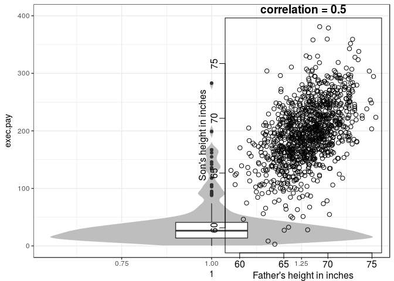<!-- -->

```r
ggplot(father.son, aes(fheight, sheight))+geom_point(color="cornflowerblue")+theme_bw()+
  xlab("Father's height in inches")+ylab("Son's height in inches")
```

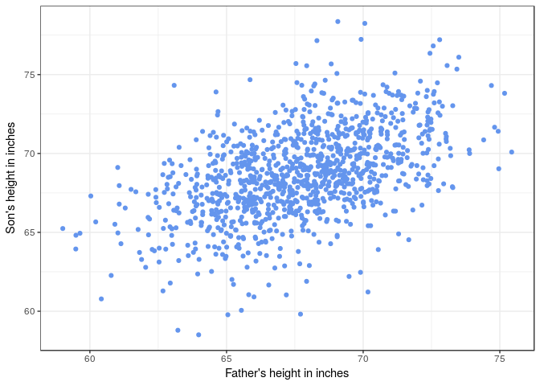<!-- -->

```r
########### 
## Stratification
###########  
groups <- split(y,round(x))
boxplot(groups)
print(mean(y[ round(x) == 72]))
```

```
## [1] 70.67719
```

```r
library(reshape2)
ggplot(melt(groups), aes(L1, value, fill=L1))+geom_boxplot()+theme_bw()

########### 
## Bi-variate Normal distribution
###########    
groups <- split(y,round(x))
mypar(2,2)
```

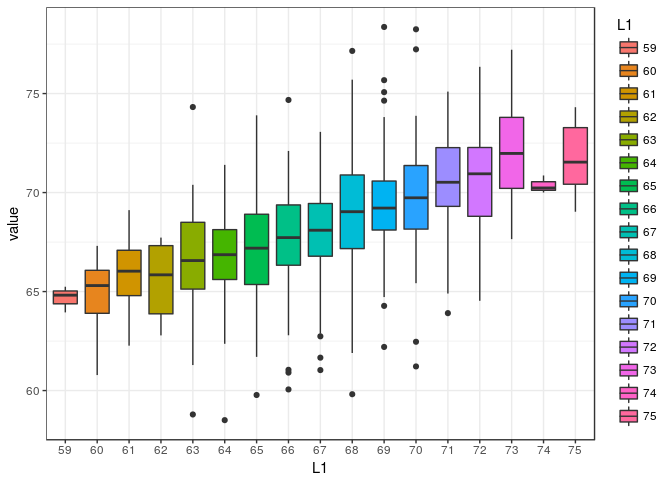<!-- -->

```r
for(i in c(5,8,11,14)){
  qqnorm(groups[[i]],main=paste0("X=",names(groups)[i]," strata"),
         ylim=range(y),xlim=c(-2.5,2.5))
  qqline(groups[[i]])
}
```

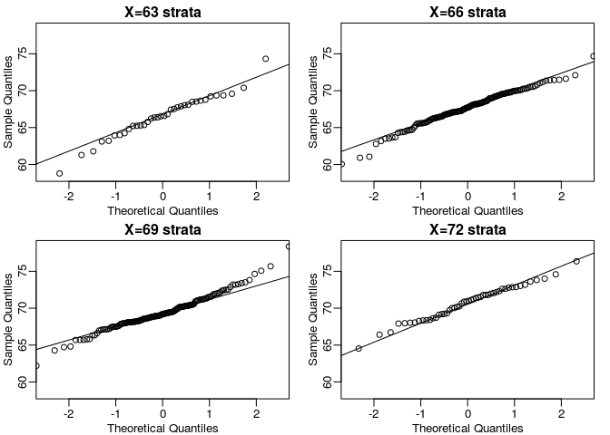<!-- -->

```r
library(psych)
```

```
## 
## Attaching package: 'psych'
```

```
## The following objects are masked from 'package:UsingR':
## 
##     galton, headtail
```

```
## The following object is masked from 'package:Hmisc':
## 
##     describe
```

```
## The following objects are masked from 'package:ggplot2':
## 
##     %+%, alpha
```

```r
scatter.hist(x=father.son$fheight, y=father.son$sheight, density=TRUE, ellipse=TRUE)
```

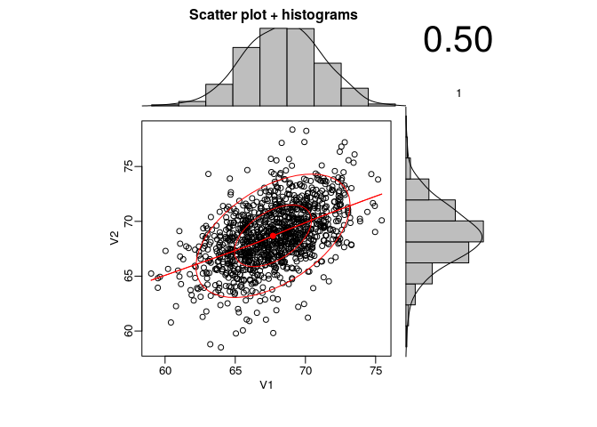<!-- -->

```r
ggplot(melt(groups)[which(melt(groups)$L1%in%c(63,66,69,72)),], aes(L1, value))+
  geom_violin(fill="grey", color="white")+geom_boxplot(width=0.1)+theme_bw()+
  xlab("Father Height Strata")+ylab("Son Height")
```

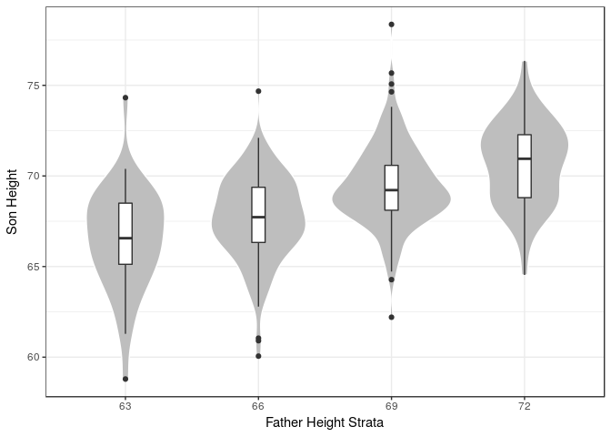<!-- -->

```r
#center/standardize
x=( x-mean(x) )/sd(x) #father.son$fheight
y=( y-mean(y) )/sd(y) #father.son$sheight
means=tapply(y, round(x*4)/4, mean)#rounds the son heights to the nearest 0.25 then startifies farther height by those intervals and takes mean
fatherheights=as.numeric(names(means))
mypar(1,1)
plot(fatherheights, means, ylab="average of strata of son heights", ylim=range(fatherheights))
abline(0, cor(x,y))
```

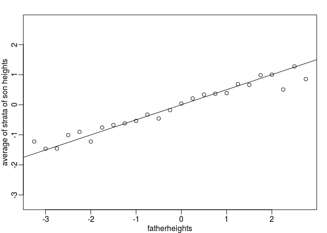<!-- -->

```r
########### 
## Plots to avoid
########### 
library("downloader")
filename <- "fig1.RData"
url <- "https://github.com/kbroman/Talk_Graphs/raw/master/R/fig1.RData"
if (!file.exists(filename)) download(url,filename)
load(filename)

library(rafalib)
mypar()
dat <- list(Treatment=x,Control=y)
boxplot(dat,xlab="Group",ylab="Response",cex=0)
stripchart(dat,vertical=TRUE,method="jitter",pch=16,add=TRUE,col=1)
```

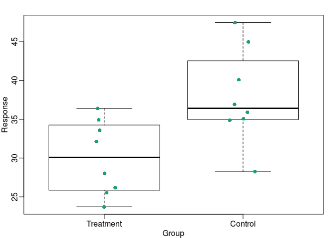<!-- -->

```r
ggplot(melt(dat), aes(L1, value))+geom_boxplot(fill="lightgrey", width=0.5)+geom_point(color="cornflowerblue",size=3,position=position_jitter(w=0.25))+theme_bw()+xlab("Group")+ylab("Response")
```

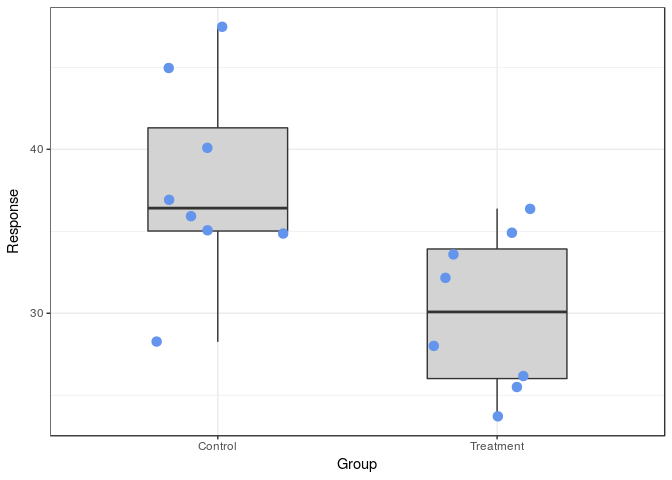<!-- -->

```r
url <- "https://github.com/kbroman/Talk_Graphs/raw/master/R/fig4.RData"
filename <- "fig4.RData"
if (!file.exists(filename)) download(url, filename)
load(filename)
mypar(1,2)
plot(x,y,lwd=2,type="n")
fit <- lm(y~x)
abline(fit$coef,lwd=2)
b <- round(fit$coef,4)
text(78, 200, paste("y =", b[1], "+", b[2], "x"), adj=c(0,0.5))
rho <- round(cor(x,y),4)
text(78, 187,expression(paste(rho," = 0.8567")),adj=c(0,0.5))
plot(x,y,lwd=2)
fit <- lm(y~x)
abline(fit$coef,lwd=2)
```

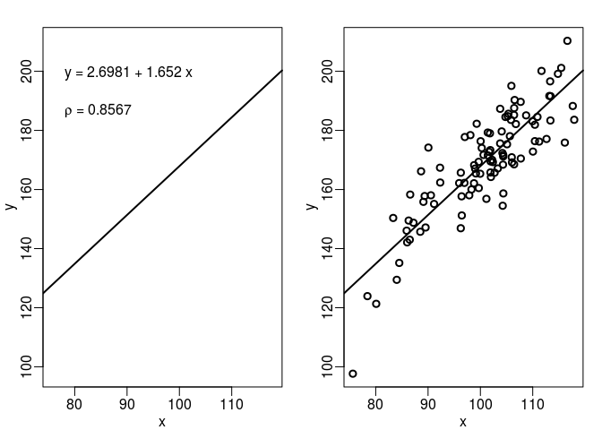<!-- -->

```r
########################
## Exercises
########################

# Q1
#6

# Q2
ggplot(InsectSprays, aes(spray, count))+geom_boxplot(aes(fill=spray),outlier.size = NA)+theme_bw()+ 
  geom_point(shape=21, color="black", fill="grey",position=position_jitter(w=0.25))
```

<!-- -->

```r
# Q3
url <- "http://courses.edx.org/c4x/HarvardX/PH525.1x/asset/skew.RData"
filename <- "skew.RData"
if (!file.exists(filename)) download(url,filename)
load(filename)

dat<-as.data.frame(dat)
dat_plt<-melt(dat)
```

```
## No id variables; using all as measure variables
```

```r
ggplot(dat_plt, aes(variable, value))+geom_violin(fill="lightgrey")+geom_boxplot(aes(fill=variable),outlier.size = NA, width=0.15)+theme_bw()
```

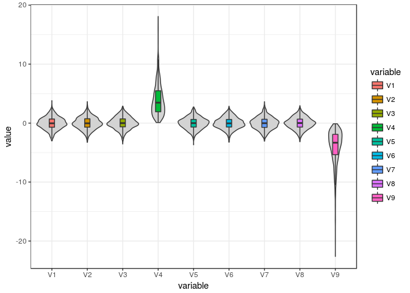<!-- -->

```r
#column 4 and 9 are weird, and column 4 is skewed positively

# Q4
#column 9 is negatively skewed

# Q5
library(dplyr)
```

```
## 
## Attaching package: 'dplyr'
```

```
## The following objects are masked from 'package:Hmisc':
## 
##     combine, src, summarize
```

```
## The following object is masked from 'package:MASS':
## 
##     select
```

```
## The following objects are masked from 'package:stats':
## 
##     filter, lag
```

```
## The following objects are masked from 'package:base':
## 
##     intersect, setdiff, setequal, union
```

```r
data(nym.2002, package="UsingR")

ggplot(nym.2002, aes(gender, time))+geom_violin(fill="lightgrey")+geom_boxplot(aes(fill=gender),outlier.size = NA, width=0.25)+theme_bw()
```

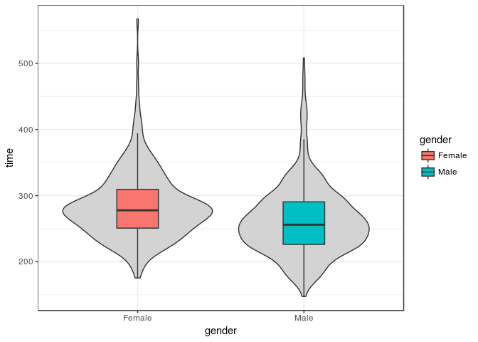<!-- -->

```r
ggplot(nym.2002, aes(time, color=gender))+geom_density(size=1)+theme_bw()
```

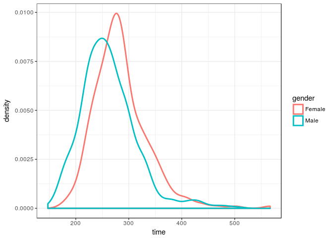<!-- -->

```r
tapply(nym.2002$time, nym.2002$gender, mean)
```

```
##   Female     Male 
## 284.9366 261.8209
```

```r
#C

# Q6
nym.2002 %>%
  group_by(gender) %>%
  summarize(cor(age, time, method="pearson"))
```

```
## # A tibble: 2 × 2
##   gender `cor(age, time, method = "pearson")`
##   <fctr>                                <dbl>
## 1 Female                            0.2443156
## 2   Male                            0.2432273
```

```r
#males 0.243; females 0.244

# Q8
#scatter
ggplot(nym.2002, aes(age, time, fill=gender))+geom_point(shape=21, color="black")+theme_bw()+stat_smooth(method="lm", se=F)
```

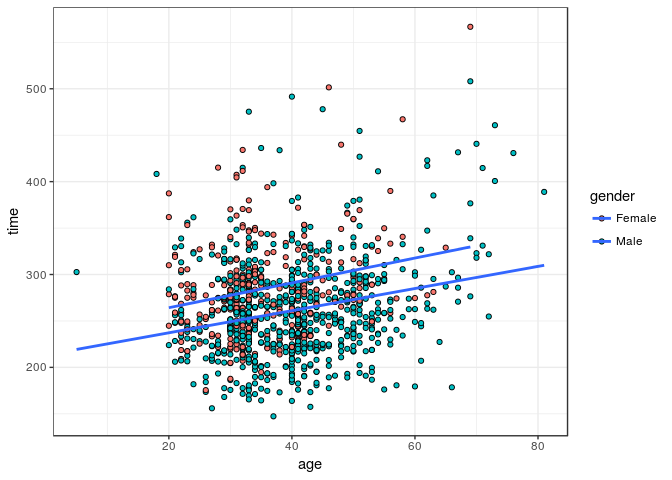<!-- -->

```r
# boxplot
mround <- function(x,base){ 
  base*round(x/base) 
} 

groups <- split(nym.2002$time,mround(nym.2002$age,5))

library(reshape2)
plt<-melt(groups)
plt$Age_Group<-as.numeric(plt$L1)
ggplot(plt, aes(as.factor(Age_Group), value, fill=Age_Group))+geom_boxplot()+theme_bw()+ylab("Time")
```

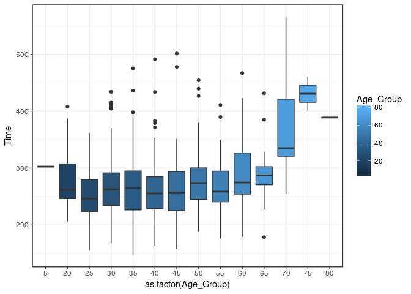<!-- -->

```r
# A

# Q9
#D

#Q10
#D


########### 
## Robust Summaries
########### 

set.seed(1)
x=c(rnorm(100,0,1)) ##real distribution
x[23] <- 100 ##mistake made in 23th measurement
boxplot(x)
cat("The average is",mean(x),"and the SD is",sd(x))
```

```
## The average is 1.108142 and the SD is 10.02938
```

```r
median(x)
```

```
## [1] 0.1684483
```

```r
# Spearman correlation
set.seed(1)
x=c(rnorm(100,0,1)) ##real distribution
x[23] <- 100 ##mistake made in 23th measurement
y=c(rnorm(100,0,1)) ##real distribution
y[23] <- 84 ##similar mistake made in 23th measurement
library(rafalib)
mypar()
```

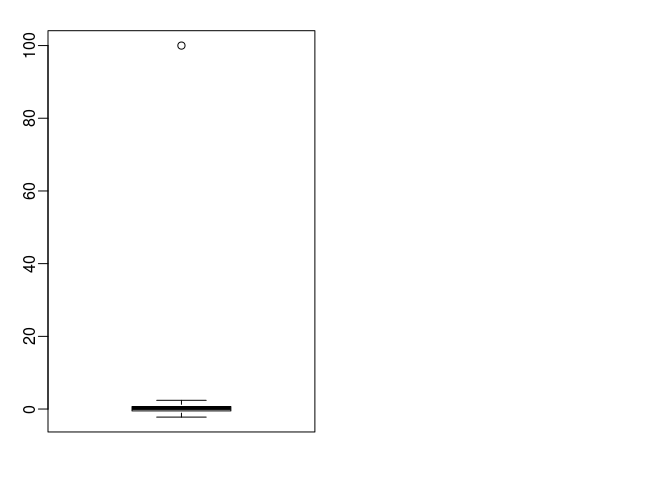<!-- -->

```r
plot(x,y,main=paste0("correlation=",round(cor(x,y),3)),pch=21,bg=1,xlim=c(-3,100),ylim=c(-3,100))
abline(0,1)
```

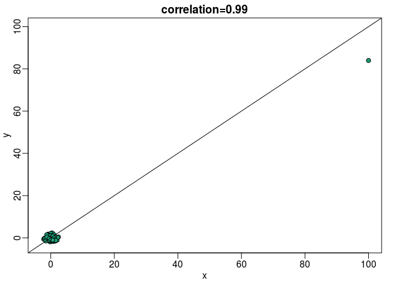<!-- -->

```r
mypar(1,2)
plot(x,y,main=paste0("correlation=",round(cor(x,y),3)),pch=21,bg=1,xlim=c(-3,100),ylim=c(-3,100))
plot(rank(x),rank(y),main=paste0("correlation=",round(cor(x,y,method="spearman"),3)),pch=21,bg=1,xlim=c(-3,100),ylim=c(-3,100))
abline(0,1)
```

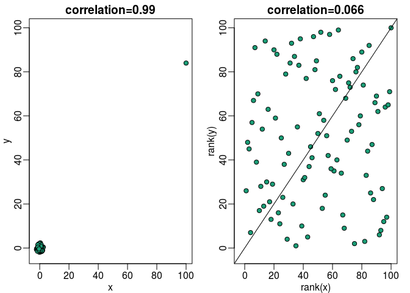<!-- -->

```r
## log ratios
x <- 2^(rnorm(100))
y <- 2^(rnorm(100))
ratios <- x / y

mypar(1,2)
hist(ratios)
logratios <- log2(ratios)
hist(logratios)
```

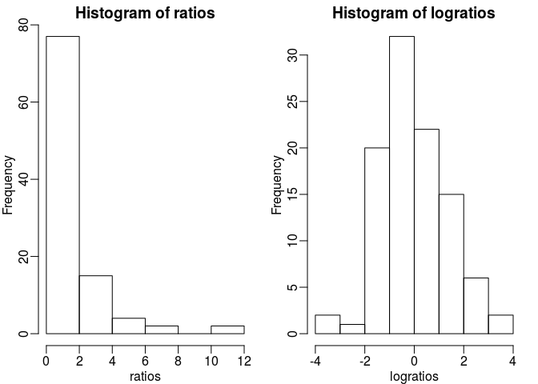<!-- -->

```r
########### 
## Wilcoxon Rank Sum Test
########### 

set.seed(779) ##779 picked for illustration purposes
N=25
x<- rnorm(N,0,1)
y<- rnorm(N,0,1)
x[1] <- 5
x[2] <- 7
cat("t-test pval:",t.test(x,y)$p.value)
```

```
## t-test pval: 0.04439948
```

```r
cat("Wilcox test pval:",wilcox.test(x,y)$p.value)
```

```
## Wilcox test pval: 0.1310212
```

```r
library(rafalib)
mypar(1,2)
stripchart(list(x,y),vertical=TRUE,ylim=c(-7,7),ylab="Observations",pch=21,bg=1)
abline(h=0)
xrank<-rank(c(x,y))[seq(along=x)]
yrank<-rank(c(x,y))[-seq(along=y)]
stripchart(list(xrank,yrank),vertical=TRUE,ylab="Ranks",pch=21,bg=1,cex=1.25)
ws <- sapply(x,function(z) rank(c(z,y))[1]-1)
text( rep(1.05,length(ws)), xrank, ws, cex=0.8)
```

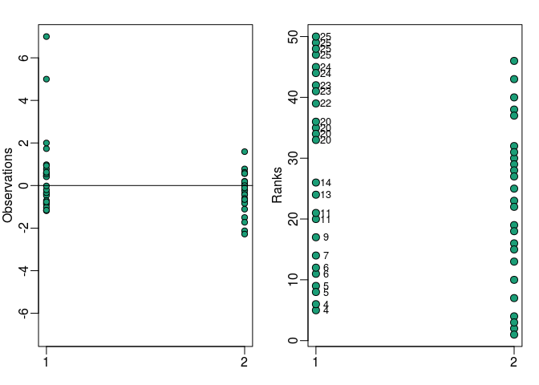<!-- -->

```r
W <-sum(ws)


########################
## Exercises
########################
data(ChickWeight)
head(ChickWeight)
```

```
##   weight Time Chick Diet
## 1     42    0     1    1
## 2     51    2     1    1
## 3     59    4     1    1
## 4     64    6     1    1
## 5     76    8     1    1
## 6     93   10     1    1
```

```r
plot( ChickWeight$Time, ChickWeight$weight, col=ChickWeight$Diet)

ggplot(ChickWeight, aes(Time, weight, fill=Diet))+geom_point(shape=21, size=2,color="black")+theme_bw()

chick = reshape(ChickWeight, idvar=c("Chick","Diet"), timevar="Time",
                direction="wide")

head(chick)
```

```
##    Chick Diet weight.0 weight.2 weight.4 weight.6 weight.8 weight.10
## 1      1    1       42       51       59       64       76        93
## 13     2    1       40       49       58       72       84       103
## 25     3    1       43       39       55       67       84        99
## 37     4    1       42       49       56       67       74        87
## 49     5    1       41       42       48       60       79       106
## 61     6    1       41       49       59       74       97       124
##    weight.12 weight.14 weight.16 weight.18 weight.20 weight.21
## 1        106       125       149       171       199       205
## 13       122       138       162       187       209       215
## 25       115       138       163       187       198       202
## 37       102       108       136       154       160       157
## 49       141       164       197       199       220       223
## 61       141       148       155       160       160       157
```

```r
chick = na.omit(chick)

#Q1
no_out<-chick$weight.4
with_out<-c(chick$weight.4,3000)

mean(with_out)/mean(no_out)
```

```
## [1] 2.062407
```

```r
# 2.06 fold change in mean

#Q2 
median(with_out)/median(no_out)
```

```
## [1] 1
```

```r
# no change


#Q3
sd(with_out)/sd(no_out)
```

```
## [1] 101.2859
```

```r
# 101.3 fold change in mean

#Q4 
mad(with_out)/mad(no_out)
```

```
## [1] 1
```

```r
# no change

#Q5
ggplot(chick, aes(weight.4, weight.21))+geom_point(shape=21, size=2,fill="cornflowerblue")+theme_bw()

cor(chick$weight.4, chick$weight.21)
```

```
## [1] 0.4159499
```

```r
cor(c(chick$weight.4,3000),c(chick$weight.21,3000))
```

```
## [1] 0.9861002
```

```r
cor(chick$weight.4, chick$weight.21)/cor(c(chick$weight.4,3000),c(chick$weight.21,3000))
```

```
## [1] 0.421813
```

```r
#0.42 fold change

#Q6
x=chick$weight.4
y=chick$weight.21

t.test(x,y)
```

```
## 
## 	Welch Two Sample t-test
## 
## data:  x and y
## t = -14.845, df = 44.315, p-value < 2.2e-16
## alternative hypothesis: true difference in means is not equal to 0
## 95 percent confidence interval:
##  -180.0515 -137.0152
## sample estimates:
## mean of x mean of y 
##  60.15556 218.68889
```

```r
wilcox.test(x,y)
```

```
## Warning in wilcox.test.default(x, y): cannot compute exact p-value with
## ties
```

```
## 
## 	Wilcoxon rank sum test with continuity correction
## 
## data:  x and y
## W = 0, p-value = 3.057e-16
## alternative hypothesis: true location shift is not equal to 0
```

```r
#add outlier
x=c(chick$weight.4,3000)
y=c(chick$weight.21,3000)

t.test(x,y)
```

```
## 
## 	Welch Two Sample t-test
## 
## data:  x and y
## t = -1.7505, df = 89.85, p-value = 0.08345
## alternative hypothesis: true difference in means is not equal to 0
## 95 percent confidence interval:
##  -331.10337   20.92946
## sample estimates:
## mean of x mean of y 
##  124.0652  279.1522
```

```r
wilcox.test(x,y)
```

```
## Warning in wilcox.test.default(x, y): cannot compute exact p-value with
## ties
```

```
## 
## 	Wilcoxon rank sum test with continuity correction
## 
## data:  x and y
## W = 45.5, p-value = 2.642e-15
## alternative hypothesis: true location shift is not equal to 0
```

```r
#Q8
x=chick$weight.4
y=chick$weight.21

library(rafalib)
mypar(1,3)
```

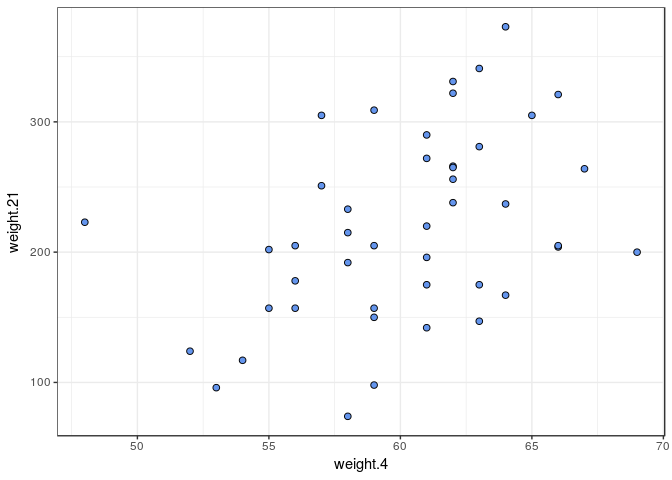<!-- -->

```r
boxplot(x,y)
boxplot(x,y+10)
boxplot(x,y+100)
```

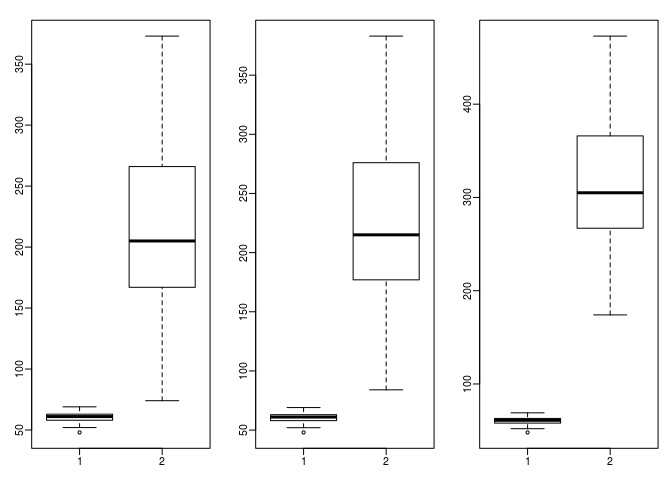<!-- -->

```r
t.test(x,y)$statistic
```

```
##         t 
## -14.84506
```

```r
t.test(x,y+10)$statistic
```

```
##         t 
## -15.78146
```

```r
t.test(x,y+100)$statistic
```

```
##         t 
## -24.20906
```

```r
-15.78146-(-24.20906)
```

```
## [1] 8.4276
```

```r
#Q9
wilcox.test(x,y)$statistic
```

```
## Warning in wilcox.test.default(x, y): cannot compute exact p-value with
## ties
```

```
## W 
## 0
```

```r
wilcox.test(x,y+10)$statistic
```

```
## Warning in wilcox.test.default(x, y + 10): cannot compute exact p-value
## with ties
```

```
## W 
## 0
```

```r
wilcox.test(x,y+100)$statistic
```

```
## Warning in wilcox.test.default(x, y + 100): cannot compute exact p-value
## with ties
```

```
## W 
## 0
```

```r
t.test(c(1,2,3) , c(4,5,6))
```

```
## 
## 	Welch Two Sample t-test
## 
## data:  c(1, 2, 3) and c(4, 5, 6)
## t = -3.6742, df = 4, p-value = 0.02131
## alternative hypothesis: true difference in means is not equal to 0
## 95 percent confidence interval:
##  -5.2669579 -0.7330421
## sample estimates:
## mean of x mean of y 
##         2         5
```

```r
wilcox.test(c(1,2,3) , c(4,5,6))
```

```
## 
## 	Wilcoxon rank sum test
## 
## data:  c(1, 2, 3) and c(4, 5, 6)
## W = 0, p-value = 0.1
## alternative hypothesis: true location shift is not equal to 0
```

```r
#Q10
t.test(c(1,2,3) , c(400,500,600))
```

```
## 
## 	Welch Two Sample t-test
## 
## data:  c(1, 2, 3) and c(400, 500, 600)
## t = -8.6252, df = 2.0004, p-value = 0.01317
## alternative hypothesis: true difference in means is not equal to 0
## 95 percent confidence interval:
##  -746.3786 -249.6214
## sample estimates:
## mean of x mean of y 
##         2       500
```

```r
wilcox.test(c(1,2,3) , c(400,500,600))
```

```
## 
## 	Wilcoxon rank sum test
## 
## data:  c(1, 2, 3) and c(400, 500, 600)
## W = 0, p-value = 0.1
## alternative hypothesis: true location shift is not equal to 0
```
