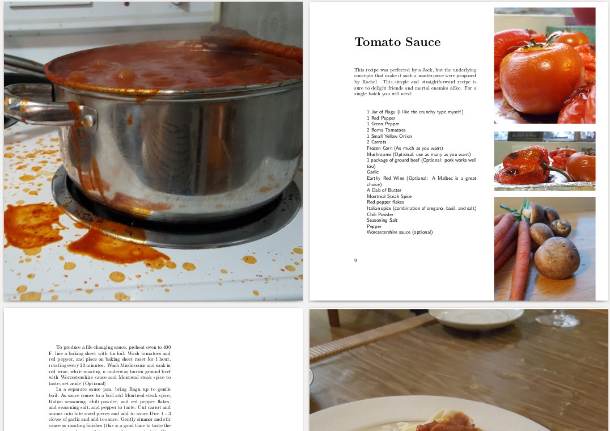
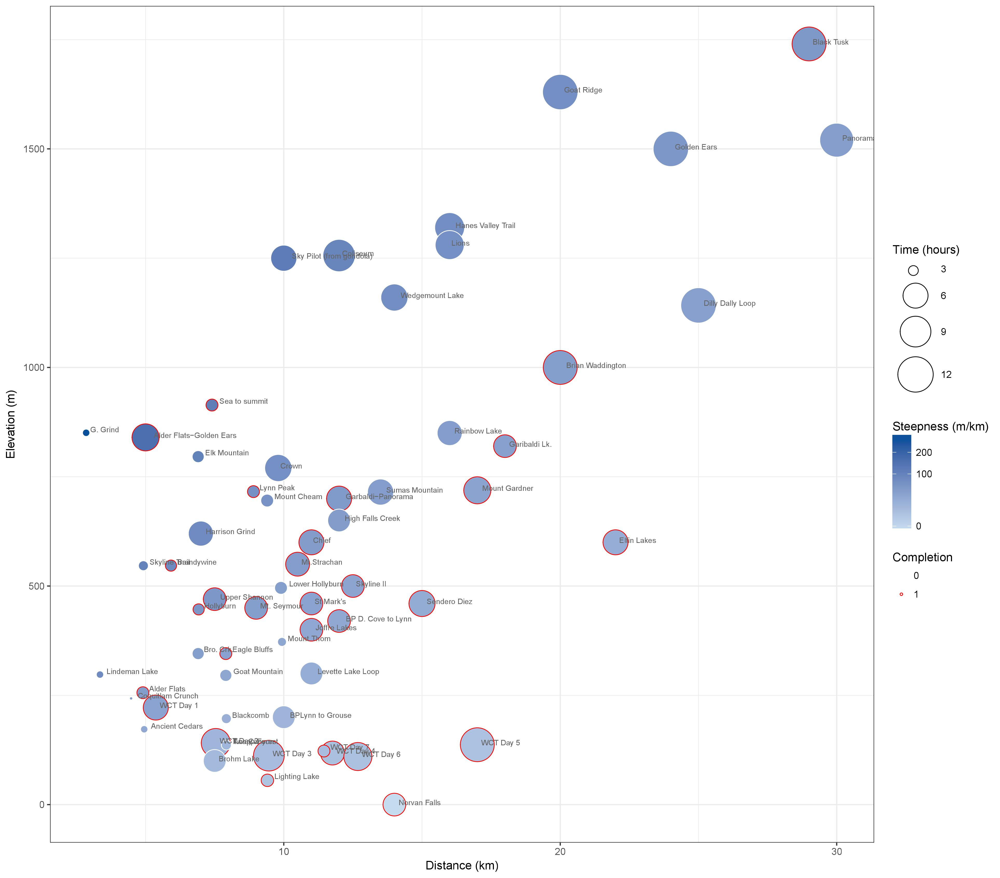

# General_Analysis
Catch all repository for side analyses and nonsense

### EIPP Data Visualization
I am planning a project for the EIPP course on data visualization and will develop a workflow for the initial tutorial [here](https://redgar598.github.io/eipp_data_viz/).

### A cook book layout for LaTeX
Lot's of the recipes have to be filled out, but the overall format is nice and pages can just  be duplicated for more content. 

  

### Hiking Comparison Plot

What hike should you do in the BC lower main land? Here is how hikes compared on elevation, time distance, how steep and importantly if I have already done it. There is data and code for this plot available [here](https://github.com/redgar598/General_Analysis/tree/master/hike_plot)

  

### How Much My Cat Bites 

  

