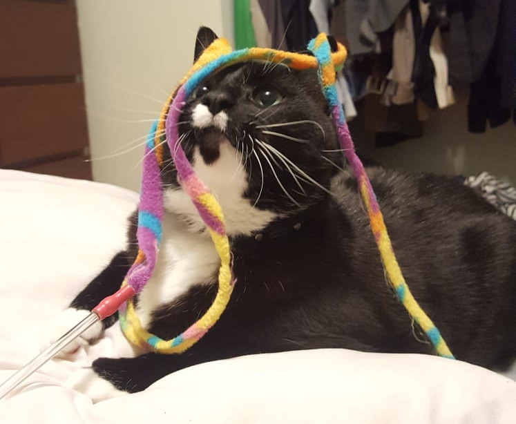
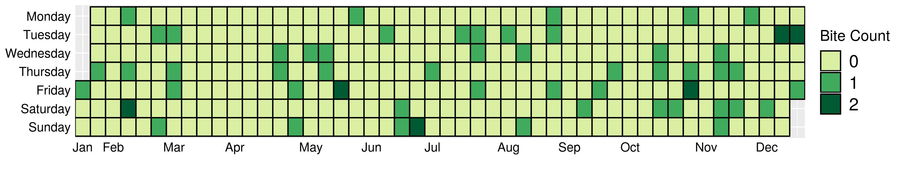
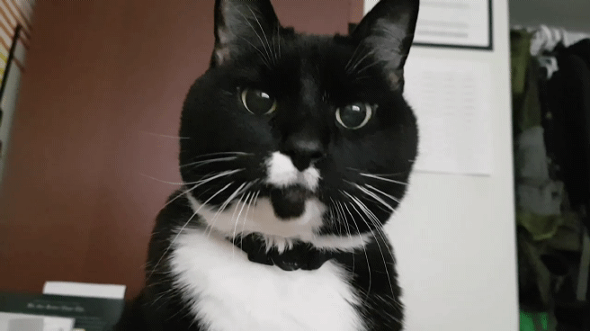
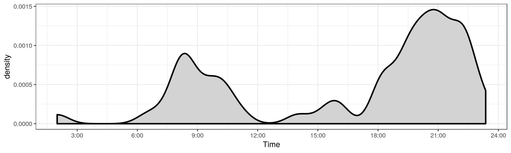
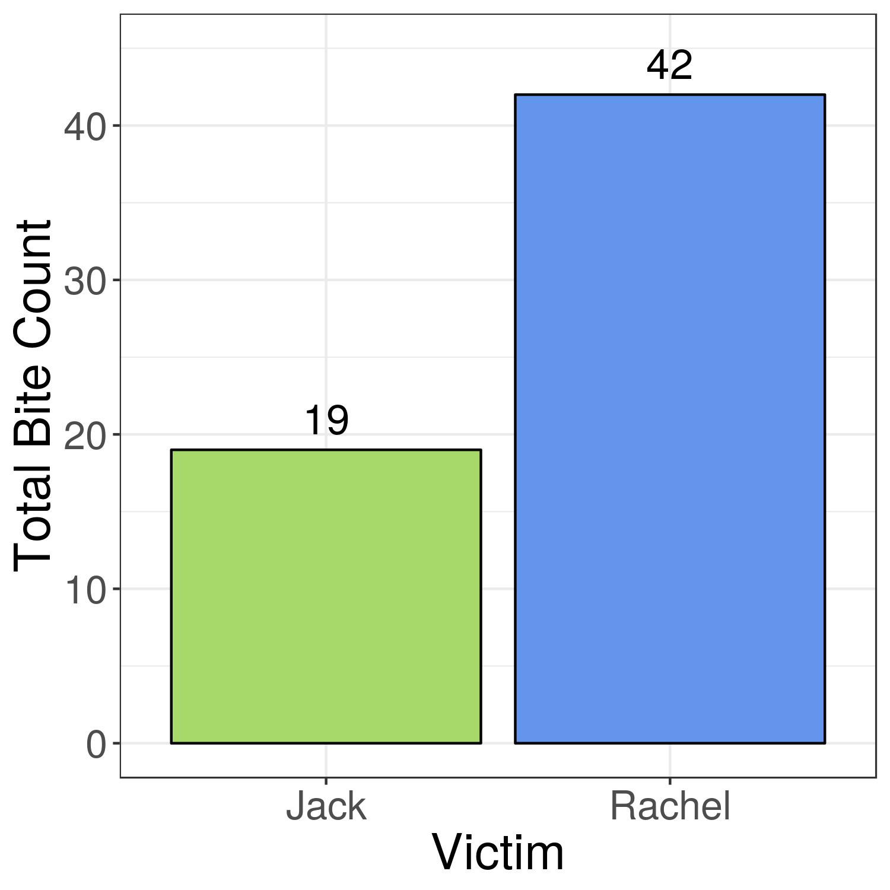
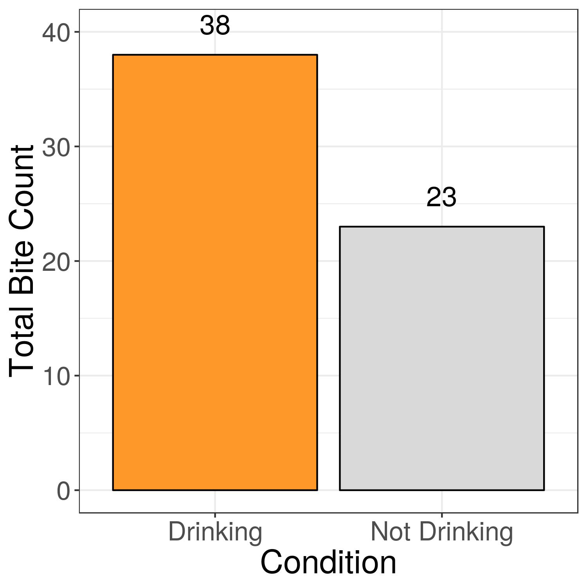
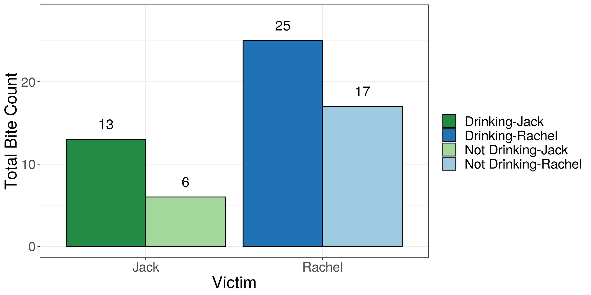
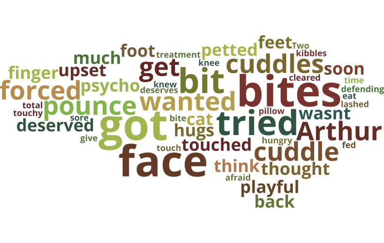
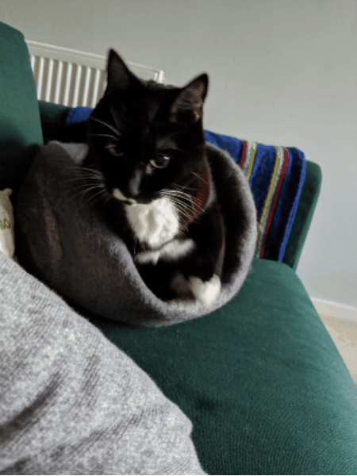

# A Deeper Understanding on My Cat Bites
In 2015 my boyfriend and I adopted a 10 year old cat from the BC SPCA. He was (and is) a snuggly wonderful dream. He was given up for adoption twice. Which is heartbreaking. The second time was after only being in a home for a few months. The person who returned him said it was because if bites. We scoffed at this. THIS GUY? He would never!

We were wrong. His language of love is in-fact, biting. He is still the love of our lives and we find the biting gives him more personality and our lives...spontaneity. We never have kids around him, all our guests get a fair warning, and we have disinfectants ready at all times. 

In 2017 we decided to track his biting. We had a few hypotheses about his behaviour and wanted data on what his deal is. 

So for a year anytime we got bit we recorded it. Here is the number of bites spread over the year. In total there were 61 successfully landed bites (and many more attempts). Yes days with two bites were somber days in the home. 

We had thought there was a biting hour in the late evening (after 10) but actually there is a peak as 9pm and bites become less frequent toward bedtime. 

Our main original question: who does he love more! i.e who gets more bites. We were in no way shocked. 

We had a suspicion that whether we had had a drink would affect the number of bites. When I have had a drink I want to cuddle my cat, Arthur does not always agree. So yes drinking -> grabbing the cat -> bites.

An upsetting fact for me was when I split the data by victim and drinking. A sober Rachel still gets bit more than I drinking Jack. 

Part way through the year we started to add comments for more detail on the bite context. There seems to be some fairly strong feelings in this word cloud. 

In conclusion, we learned a lot about Arthur and ourselves. He remains the love of our lives and continues to defend himself fiercely when necessary. 

